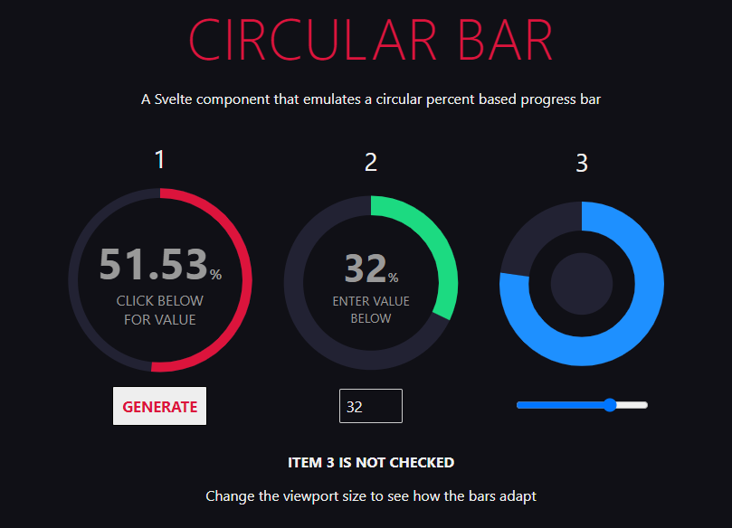

# Circle Bar

### A Svelte component that emulates a circular percent based progress bar

This component uses SVG to generate an animated circle progress bar showing a percentage. It will show the percentage digits in the center of the circle together with an optional very short description. It will adapt to it's parent container and generate its box based on its parent smaller side. You can pick the colors, the short text description and, of course the value between 0 - 100.

Values above 100 will render as 100 and below 0 will render as 0.




## Instalation

**Only tested on Svelte 3**

This is so simple that it doesn't need a NPM package. Just copy the file ``/src/circularbar.svelte`` to your project's appropriate folder and import it where needed. All other files are just there for the sake of the example.


## Example

Download this code, extract it and run:

```
npm i
npm run dev
```